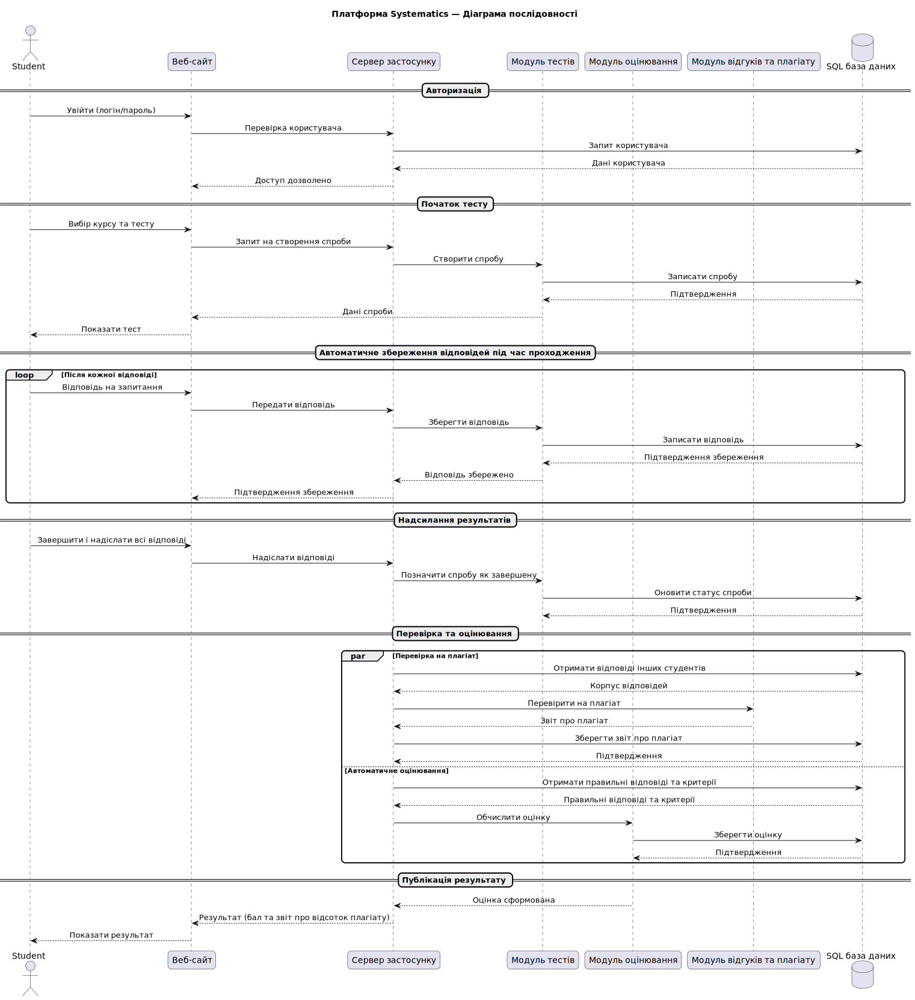

# Високорівнева архітектура

## 1. Загальний опис архітектури 

### Обраний архітектурний стиль 
Обрано **клієнт-серверну архітектуру**, де комунікація між компонентами відбувається через REST API. Обов'язки чітко розподіляються між клієнтом-вебсайтом і сервером. Обгрунтування вибору:

- **Пряма відповідність вимогам**: Модель «запит-відповідь» ідеально підходить для реалізації більшості функцій системи, таких як отримання оцінок, перегляд іспитів та аналітика.
- **Контроль доступу та безпека**: Централізований сервер забезпечує надійний контроль над даними та дозволяє ефективно реалізувати управління доступом на основі ролей.
- **Простота та керованість**: Архітектура має чітку та зрозумілу структуру, що значно спрощує розробку, тестування та подальшу підтримку системи.

Ми відхилили архітектуру, керовану подіями (Event-Driven), оскільки ключові процеси нашої системи є синхронними і вимагають негайної відповіді від сервера.

## 2. Основні компоненти 

- Вебсайт
- Сервіс автентифікації
- Каталог курсів
- Управління тестами
- Сервіс оцінювання
- Сервіс перевірки на плагіат
- Сервіс сповіщень
- SQL База даних
- Зовнішні сервіси (Поштовий сервер)

### Зона відповідальності компонентів 
- **Вебсайт** — слугує єдиним графічним інтерфейсом, через який користувачі взаємодіють з усіма функціями платформи.
- **Сервіс автентифікації** — перевіряє облікові дані користувача та визначає його роль для надання відповідних прав доступу.
- **Каталог курсів** — надає інформацію про доступні курси та тести для відображення на вебсайті.
- **Управління тестами** — обробляє всю логіку іспиту, включаючи початок сесії, керування таймером та приймання відповідей.
- **Сервіс оцінювання** — проводить автоматичну перевірку тестових завдань та ініціює аналіз відкритих відповідей на плагіат.
- **Сервіс перевірки на плагіат** — аналізує текстові роботи на наявність запозичень та повертає детальний звіт.
- **Сервіс сповіщень** — інформує користувачів про важливі події, такі як майбутні іспити або результати перевірки на плагіат.
- **SQL База даних** — є центральним сховищем, де зберігаються всі дані системи, включаючи профілі користувачів, курси та результати іспитів.
- **Поштовий сервер** — це зовнішній сервіс, який відповідає за фактичну доставку електронних листів, згенерованих Сервісом сповіщень.

### Комунікація між компонентами

1. Користувач через Вебсайт заходить у систему. Вебсайт звертається до Сервісу автентифікації для перевірки даних.
2. Після входу Вебсайт запитує у Каталогу курсів список доступних тестів для відображення.
3. Коли студент починає тест, Вебсайт взаємодіє з сервісом Управління тестами, який керує процесом.
4. Після завершення тесту Управління тестами надсилає відповіді до Сервісу оцінювання.
5. Сервіс оцінювання, у свою чергу, може надіслати запит до Сервісу перевірки на плагіат.
6. Після аналізу Сервіс перевірки на плагіат передає звіт до Сервісу сповіщень, який через зовнішній Поштовий сервер (по протоколу SMTP) інформує студента.
7. Майже всі сервіси постійно звертаються до SQL бази даних, щоб зберігати та отримувати дані (наприклад, зберегти оцінку або отримати список студентів).

## 3. Діаграми

Представлено діаграми компонентів, послідовності, розгортання та діяльності.

### Діаграма компонентів

Ця діаграма показує, як Вебсайт через REST API взаємодіє з різними сервісами, які використовують спільну базу даних SQL для роботи та поштовий сервер для сповіщень.

### Діаграма послідовності

Ця діаграма покроково показує, який компонент системи, кому і в якому порядку надсилає повідомлення (запити та відповіді) протягом усього процесу — від входу студента до отримання фінальної оцінки.

### Діаграма розгортання

Ця діаграма розгортання показує, як компоненти системи фізично розміщені на сервері додатку, сервері бази даних та у браузері користувача, а також їхню мережеву взаємодію між собою та із зовнішнім поштовим сервісом.

### Діаграма діяльності

Ця діаграма діяльності покроково ілюструє весь робочий процес проходження тесту студентом, від його авторизації до фінального етапу, де автоматичне оцінювання та перевірка на плагіат виконуються паралельно.

## 4. Ключові архітектурні рішення (ADR)

- [ADR-001: Автозбереження відповідей](../architecture/ADR-001.md)
- [ADR-002: Перевірка на плагіат](../architecture/ADR-002.md)
- [ADR-003: Клієнтська частина автентифікації та контролю доступу](../architecture/ADR-003.md)

## 5. Технологічний стек

- Frontend: Vue.js, TypeScript
- Backend: Python, psycopg2
- База даних: PostgreSQL
- Інше: Docker

## 6. Як компоненти взаємодіють

- **Клієнт-серверна комунікація**: Основна взаємодія відбувається за моделлю «клієнт-сервер». Вебсайт (клієнт) надсилає HTTP-запити через REST API до відповідних бекенд-сервісів (сервер) для отримання даних, автентифікації та надсилання відповідей.
- **Внутрішня комунікація**: Бекенд-сервіси спілкуються між собою через внутрішні API-виклики.
- **Взаємодія з базою даних**: Усі сервіси, що працюють з даними (користувачі, курси, оцінки), напряму взаємодіють з центральною SQL базою даних.
- **Зовнішні сервіси**: Для зв'язку із зовнішніми системами використовуються стандартні протоколи.