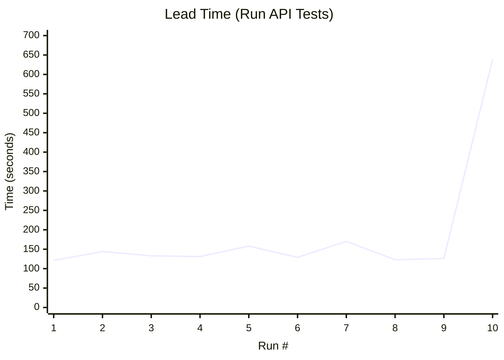
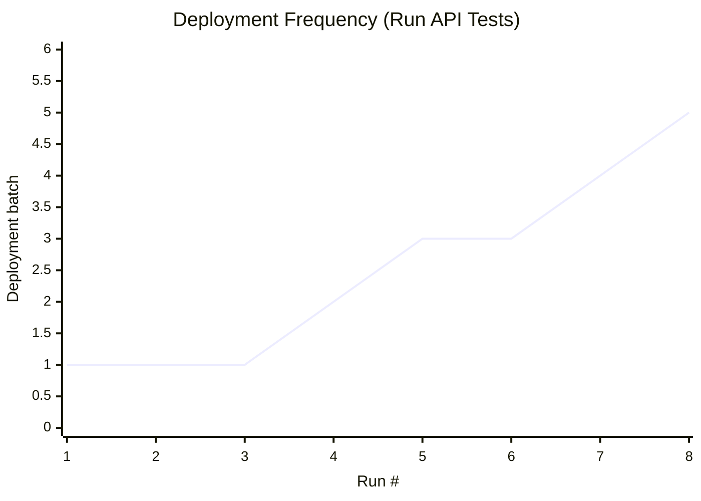
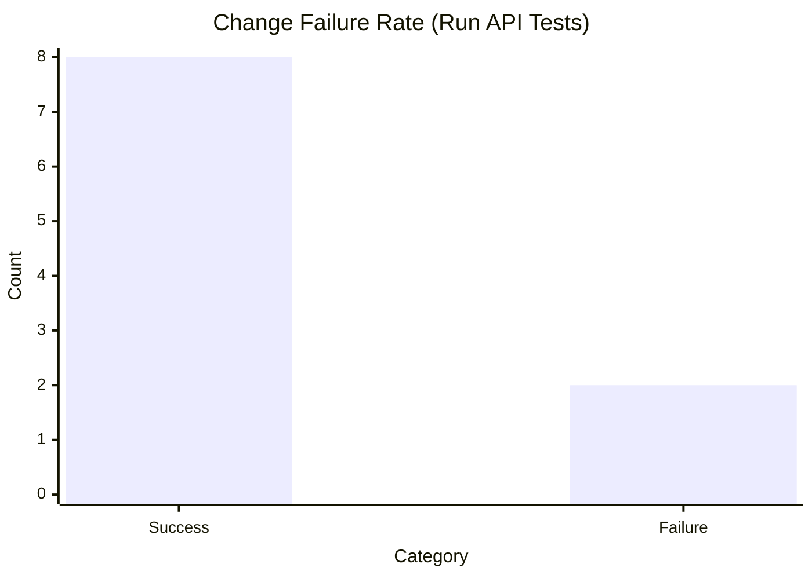
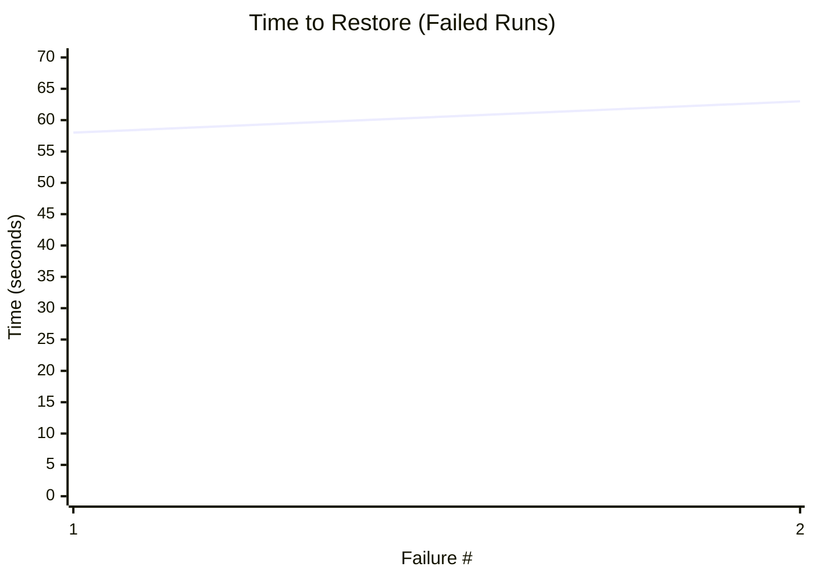

### Status on `Nov 16.11 at 12:30 AM` 
## Зміст
- [Метрики](#метрики)
- [Аналіз](#аналіз)
- [Backlog](#backlog)
- [Який біль у нашій команді показали ці метрики](#рефлексія)
- [Графік](#графік)
- [Презентація](#презентація)
---

## Метрики

- Deployment Frequency: Total number of successful deployments / number of weeks from the first deployment to the current week.
- Lead Time for Changes: Total time of all successful merges / number of merges.
- Change Failure Rate: Total number of failed deployments / total number of deployments * 100%
- Time to Restore: Time from the first failed build to the first successful one / number of gaps when builds were unsuccessful.
-------

# Pages-build-deployment:
## Гілка main

- data of the first merge: `Oct 8, 2:15 AM`
- data of the last merge: `Oct 8, 2:19 PM`
- number of weeks from the first merge: `5`
- last commit: `4d2279a`
- number of merges: `6`
  - successful: `6`
  - failed: `0`
- number of gaps when there were failures: `0`
- total tome of all successful build: `4m 27s`
- total failure time: `0d 0h 0m`

| Metric                | Formula                            | Your Result            | Category* |
|-----------------------|------------------------------------|:----------------------:|-----------|
| Deployment Frequency  | #successful deployments / week     | 6/5 = 1.2              | Low       |
| Lead Time for Changes | mean(merge → deploy time)          | 267/6 = 44,5s          | High      |
| Change Failure Rate   | failed / total deployments × 100 % | 0%                     | Elite     |
| Time to Restore       | mean(time to fix failed build)     | 0d 0h 0m               | Elite     |
---

# Run Api Tests:
## Гілка main

- data of the first merge: `Oct 8, 7:23 AM`
- data of the last merge: `Nov 15, 11:34 PM `
- number of weeks from the first merge: `5`
- last commit: `5d936a8`
- number of merges: `110`
  - successful: `41`
  - failed: `69`
- number of gaps when there were failures: `4`
- total tome of all successful build: `47m 17s`
- total failure time: `28d 23h 24m`

| Metric                | Formula                            | Your Result            | Category* |
|-----------------------|------------------------------------|:----------------------:|-----------|
| Deployment Frequency  | #successful deployments / week     | 41/5 = 8.2             | High      |
| Lead Time for Changes | mean(merge → deploy time)          | 2837/41 = 1m 9s        | Medium    |
| Change Failure Rate   | failed / total deployments × 100 % | 69/110 × 100% = 62.72% | Low       |
| Time to Restore       | mean(time to fix failed build)     | 7d 5h 51m              | Low       |
---

# CI Test:
## Гілка main

- data of the first merge: `Sep 17, 12:00 PM`
- data of the last merge: `Nov 15, 11:34 PM`
- number of weeks from the first merge: `8`
- last commit: `5d936a8`
- number of merges: `140`
  - successful: `108`
  - failed: `32`
- number of gaps when there were failures: `1`
- total tome of all successful build: `16m 48s`
- total failure time: `8d 12h 16m`

| Metric                | Formula                            | Your Result            | Category* |
|-----------------------|------------------------------------|:----------------------:|-----------|
| Deployment Frequency  | #successful deployments / week     | 108/8 = 13.5           | High      |
| Lead Time for Changes | mean(merge → deploy time)          | 1008/108 = 9,33 s      | Elite     |
| Change Failure Rate   | failed / total deployments × 100 % | 32/140 × 100% = 22.86% | High      |
| Time to Restore       | mean(time to fix failed build)     | 8d 12h 16m             | Medium    |
---

# Deploy Docs to GitHub Pages:
## Гілка main

- data of the first merge: `Oct 8, 6:38 AM`
- data of the last merge: `Nov 15, 10:44 PM`
- number of weeks from the first merge: `5`
- last commit: `5d936a8`
- number of merges: `b86abd4`
  - successful: `7`
  - failed: `0`
- number of gaps when there were failures: `0`
- total tome of all successful build: `2m 2s`
- total failure time: `0d 0h 0m`

| Metric                | Formula                            | Your Result            | Category* |
|-----------------------|------------------------------------|:----------------------:|-----------|
| Deployment Frequency  | #successful deployments / week     | 7/5 = 1.4              | Elite     |
| Lead Time for Changes | mean(merge → deploy time)          | 122/7 = 17.42 s        | High      |
| Change Failure Rate   | failed / total deployments × 100 % | 0%                     | Elite     |
| Time to Restore       | mean(time to fix failed build)     | 0d 0h 0m               | Elite     |
---

# Generate plantuml:
## Гілка main

- data of the first merge: `Sep 30, 9:00 PM`
- data of the last merge: `Nov 15, 11:34 PM `
- number of weeks from the first merge: `6`
- last commit: `5d936a8`
- number of merges: `10`
  - successful: `8`
  - failed: `2`
- number of gaps when there were failures: `1`
- total tome of all successful build: `1m 17s`
- total failure time: `45d 11h 22m`

| Metric                | Formula                            | Your Result            | Category* |
|-----------------------|------------------------------------|:----------------------:|-----------|
| Deployment Frequency  | #successful deployments / week     | 8/6 = 1.33             | Elite     |
| Lead Time for Changes | mean(merge → deploy time)          | 77/8 = 9.62 s          | Elite     |
| Change Failure Rate   | failed / total deployments × 100 % | 2/10 × 100% = 20%      | High      |
| Time to Restore       | mean(time to fix failed build)     | 45d 11h 22m            | Low       |
---

# Generate and Auto-Merge API Docs:
## Гілка main

- data of the first merge: `Oct 8, 4:21 AM`
- data of the last merge: `Nov 15, 11:34 PM`
- number of weeks from the first merge: `5`
- last commit: `5d936a8`
- number of merges: `117`
  - successful: `17`
  - failed: `100`
- number of gaps when there were failures: `2`
- total tome of all successful build: `8m 56s`
- total failure time: `31d 11h 54m`

| Metric                | Formula                            | Your Result            | Category* |
|-----------------------|------------------------------------|:----------------------:|-----------|
| Deployment Frequency  | #successful deployments / week     | 17/5 = 3.4             | Elite     |
| Lead Time for Changes | mean(merge → deploy time)          | 536/17 = 31.53 s       | High      |
| Change Failure Rate   | failed / total deployments × 100 % | 100/117 × 100% = 85.47%| Low       |
| Time to Restore       | mean(time to fix failed build)     | 15d 17h 57m            | High      |
---

## Аналіз

# CI/CD Runbook - GitHub Actions Workflows

## Огляд

Цей документ описує всі GitHub Actions workflows, що використовуються в проєкті, їх призначення, тригери та процеси виконання.

## Зміст

- [Огляд Workflows](#огляд-workflows)
- [Централізована конфігурація](#централізована-конфігурація)
- [Детальний опис кожного Workflow](#детальний-опис-кожного-workflow)

---

## Огляд Workflows

| Workflow | Призначення | Тригери | Статус |
|----------|-------------|---------|--------|
| **run-api-test.yml** | Запуск автоматичних тестів API • `test-unit`: швидкі тести без ML • `test-ml`: тести з ML (тільки на main) | Push, PR до main | ✅ Активний |
| **generate-docs.yml** | Генерація OpenAPI документації (використовує requirements-base.txt) ✅ Має бейджик статусу в README | Push до main, PR до main, Manual | ✅ Активний |
| **deploy-docs.yml** | Деплой документації на GitHub Pages | Push до main (тільки docs/api/) | ✅ Активний |
| **sonarcloud.yml** | Статичний аналіз коду | Push, PR до main | ✅ Активний |
| **uml-render.yml** | Генерація UML діаграм | Push, PR до main (тільки .puml файли) | ✅ Активний |
| **ci-test.yml** | Тестовий workflow | Push | ⚠️ Застарілий |

---

## Централізована конфігурація

Для забезпечення консистентності між workflows проєкт використовує централізовані файли конфігурації:

### `.python-version`
Вказує версію Python для проєкту. Використовується інструментами (pyenv, IDE тощо) та як джерело правди для версії Python.

**Значення:** `3.11`

### `.github/shared-config.yaml.example`
Централізований файл з налаштуваннями для всіх workflows. Слугує як документація та джерело правди для спільних налаштувань.

**⚠️ Важливо:** Файл має розширення `.example`, щоб GitHub Actions не сприймав його як workflow файл. Це запобігає помилкам при спробі виконати його як workflow.

**Основні налаштування:**

- **Python версія:** `3.11` (використовується у всіх Python workflows)
- **Node.js версія:** `20` (для frontend збірки)
- **Спільні змінні середовища:**
  - `PYTHONPATH`: `${{ github.workspace }}`
  - `DATABASE_URL`: `sqlite:///:memory:` (для тестів та генерації документації)
  - `JWT_SECRET`: `supersecretkey` (дефолтне значення з `config.py`)
- **Тестові змінні середовища:**
  - `JWT_SECRET`: `test-secret`
- **Кешування:** `pip` (для прискорення встановлення залежностей)
- **Actions версії:**
  - `actions/setup-python@v5`
  - `actions/checkout@v4`

**⚠️ Важливо:** GitHub Actions не підтримує прямий імпорт YAML файлів, тому при зміні значень в `shared-config.yaml.example` потрібно вручну оновити їх у всіх workflows.

**Використання:**
При додаванні нового workflow або зміні налаштувань:
1. Перевірити `.python-version` та `.github/shared-config.yaml.example` для актуальних значень
2. Використати ці значення у новому workflow
3. Оновити `shared-config.yaml.example` якщо додаються нові спільні налаштування

---

## Детальний опис кожного Workflow

### 1. Run API Tests (`run-api-test.yml`)

**Призначення:** Автоматичне тестування API бекенду при кожному зміні коду. Використовує оптимізовану стратегію з розділенням на швидкі unit тести та повільніші ML тести.

**Тригери:**
- Push до гілки `main`
- Pull Request до гілки `main`

**Структура Jobs:**

#### Job 1: `test-unit` - Швидкі Unit Тести (без ML)

**Призначення:** Швидкі тести без ML бібліотек для швидкої перевірки коду.

**Процес виконання:**
1. Checkout коду з репозиторію
2. Встановлення Python 3.11 з кешуванням pip залежностей
3. Встановлення базових залежностей з `requirements-base.txt` (без ML бібліотек)
4. Встановлення тестових залежностей з `pyproject.toml`
5. Запуск тестів через `pytest`

**Змінні середовища:**
- `PYTHONPATH`: дозволяє імпортувати модулі з `src/`
- `DATABASE_URL`: `sqlite:///:memory:` (in-memory БД для ізоляції тестів)
- `JWT_SECRET`: `test-secret` (тестовий секрет)

**Особливості:**
- Використовує fallback на TF-IDF (через scikit-learn) замість ML моделей
- Швидше виконання (~30-60 секунд замість 2+ хвилин)
- Запускається завжди при push/PR

**Критичність:** 🔴 Високо критичний - блокує мердж PR якщо тести не проходять

#### Job 2: `test-ml` - Integration Тести (з ML)

**Призначення:** Повні тести з ML бібліотеками для перевірки ML функціональності.

**Процес виконання:**
1. Checkout коду
2. Встановлення Python 3.11 з кешуванням pip
3. Встановлення базових залежностей з `requirements-base.txt`
4. Встановлення ML залежностей з `requirements-ml.txt` (torch, transformers, sentence-transformers)
5. Встановлення тестових залежностей
6. Запуск тестів через `pytest`

**Змінні середовища:**
- `PYTHONPATH`: дозволяє імпортувати модулі з `src/`
- `DATABASE_URL`: `sqlite:///:memory:`
- `JWT_SECRET`: `test-secret`

**Особливості:**
- Запускається тільки на push до `main` (не на PR)
- Виконується паралельно з `test-unit`
- Повільніше через встановлення ML бібліотек (~2-3 хвилини)
- Перевіряє ML функціональність (семантична схожість через sentence-transformers)

**Критичність:** 🟡 Середня - перевіряє ML функціональність, але не блокує PR

**Оптимізація:**
- Розділення на два job'и дозволяє швидко отримати feedback від unit тестів
- ML тести запускаються рідше (тільки на main) для економії часу CI/CD

---

### 2. Generate API Docs (`generate-docs.yml`)

**Призначення:** Автоматична генерація OpenAPI специфікації з FastAPI додатку та оновлення документації.

**Тригери:**
- Push до гілки `main` (автоматичний merge PR)
- Pull Request до гілки `main` (для тестування перед мерджем, без автоматичного merge)
- Ручний запуск через `workflow_dispatch` (для тестування, без автоматичного merge)
- ⚠️ Не запускається для комітів від `github-actions[bot]` (запобігає циклічним оновленням)

**Процес виконання:**
1. Checkout коду
2. Встановлення Python 3.11 з кешуванням pip залежностей
3. Встановлення базових залежностей з `requirements-base.txt` (без ML бібліотек)
4. Генерація OpenAPI YAML через `python -m src.api.export-openapi`
5. Створення Pull Request з оновленнями
6. Автоматичний merge PR (squash merge) - **тільки при push до main**

**Змінні середовища:**
- `DATABASE_URL`: `sqlite:///:memory:` (не потрібна реальна БД)
- `JWT_SECRET`: `supersecretkey` (дефолтне значення з `config.py`)
- `JWT_ALGORITHM`: `HS256`
- `JWT_EXPIRATION_MINUTES`: `60`

**Оптимізація:**
- Використовує тільки `requirements-base.txt` (без ML бібліотек) для швидшої генерації документації
- ML бібліотеки не потрібні для генерації OpenAPI специфікації
- Використовує SQLite in-memory БД для генерації (не потрібна реальна БД)
- Моделі автоматично адаптуються до SQLite через `get_json_type()` (використовує JSON замість JSONB)

**Технічні деталі:**
- Використовує функцію `get_json_type()` для сумісності з SQLite
- Всі Pydantic схеми оновлено до V2 стандартів (`from_attributes` замість `orm_mode`)

**Критичність:** 🟡 Середня - документація має бути актуальною, але не блокує розробку

**Особливості:**
- Автоматично створює PR з міткою `automerge` та `documentation`
- PR автоматично мерджиться після проходження checks **тільки при push до main**
- При `pull_request` або `workflow_dispatch` PR створюється, але не мерджиться автоматично (дозволяє перевірити зміни)
- Гілка `openapi-auto-update` видаляється після мерджу

**Тестування:**
- Можна протестувати workflow без push в main через:
  1. Створення PR до main (workflow запуститься автоматично)
  2. Ручний запуск через GitHub Actions UI (кнопка "Run workflow")

---

### 3. Deploy Docs to GitHub Pages (`deploy-docs.yml`)

**Призначення:** Публікація API документації на GitHub Pages для публічного доступу.

**Тригери:**
- Push до гілки `main`
- ⚠️ Тільки якщо змінені файли в `docs/api/**`

**Процес виконання:**
1. Checkout коду
2. Завантаження вмісту `docs/api/` як artifact
3. Деплой на GitHub Pages через вбудований deployment action

**Критичність:** 🟢 Низька - документація доступна локально, Pages - додатково

**Результат:**
- Документація доступна на GitHub Pages URL (вказується в environment `github-pages`)

---

### 4. SonarCloud Analysis (`sonarcloud.yml`)

**Призначення:** Статичний аналіз коду для виявлення вразливостей та проблем якості.

**Тригери:**
- Push до гілки `main`
- Pull Request до гілки `main`
- Manual trigger через `workflow_dispatch`

**Процес виконання:**
1. Аналіз коду через SonarCloud
2. Створення Code Scanning alerts для знайдених проблем
3. Декорування PR з результатами аналізу

**Потрібні налаштування:**
- `SONAR_TOKEN` в GitHub Secrets
- `sonar.projectKey` та `sonar.organization` в workflow файлі

**Критичність:** 🟡 Середня - покращує якість коду, але не блокує розробку

---

### 5. Generate PlantUML Diagrams (`uml-render.yml`)

**Призначення:** Генерація SVG діаграм з PlantUML файлів для документації архітектури.

**Тригери:**
- Push до гілки `main`
- Pull Request до гілки `main` (тільки при змінах в `.puml` файлах)

**Процес виконання:**
1. Checkout коду
2. Генерація SVG з `.puml` файлів через PlantUML
3. Збереження результатів в `docs/architecture/uml/uml-svgs/`

**Критичність:** 🟢 Низька - використовується для документації

**Особливості:**
- Запускається автоматично при змінах в PlantUML файлах (`docs/architecture/uml/**/*.puml`)
- Генерує SVG діаграми для документації архітектури

---

### 6. CI Test (`ci-test.yml`)

**Призначення:** Простий тестовий workflow для перевірки базової роботи GitHub Actions.

**Тригери:**
- Push до будь-якої гілки

**Процес виконання:**
- Виводить "Hello, World!"

**Статус:** ⚠️ **Застарілий** - містить лише тестовий код. Може бути видалений або замінений.

**Рекомендація:** Використовувати `run-api-test.yml` для реального тестування.

## Backlog

# Improvement Backlog - GitHub Workflows

## Root Cause Analysis & Improvement Actions

### Технічні проблеми

| Metric | Problem | Root Cause | Improvement Action | Priority | Owner |
|--------|---------|------------|-------------------|----------|-------|
| **Lead Time** | Тести виконуються 2+ хв | Великі ML бібліотеки (torch, transformers) встановлюються щоразу | 1. Розділити requirements.txt на base та ml  2. Увімкнути кешування pip  3. Matrix strategy: unit тести без ML (швидкі), ML тести окремо (повільніші) | High | Олександра Малій |
| **Failure Rate** | Generate API Docs workflow падає без зрозумілих причин | При імпорті app намагається підключитися до БД та запустити scheduler, але в workflow немає налаштувань | 1. Додати DATABASE_URL та JWT_SECRET у workflow 2. Створити окрему функцію для OpenAPI без БД 3. Перевіряти чи є зміни перед створенням PR | High | Олександра Малій |
| **Lead Time** | Тести запускаються по черзі | Немає паралелізації | 1. Додати pytest-xdist для паралельного запуску 2. Розділити тести на unit та integration 3. Використати pytest markers | Medium | Олександра Малій |
| **Test Stability** | Тести ламаються після змін коду | Тести занадто тісно пов'язані з реалізацією | 1. Додати коментарі що саме тестується 2. Оновлювати тести одразу при зміні коду 3. Використовувати pytest fixtures 4. Задокументувати які тести можна видаляти | Medium | Олександра Малій |
| **Resource Usage** | Встановлюються зайві залежності | Немає умовного встановлення | 1. Розділити jobs на unit (без ML) та integration тести  2. Використати matrix strategy  3. Кешувати venv (pip cache) | Low | Олександра Малій |

### Процесні / Культурні проблеми

| Metric | Problem | Root Cause | Improvement Action | Priority | Owner |
|--------|---------|------------|-------------------|----------|-------|
| **Deployment Safety** | Деплоїмо навіть якщо частина workflows впала | Немає блокування деплою при помилках | 1. Налаштувати required status checks для main 2. Блокувати деплой якщо workflows впали 3. Всі критичні workflows мають пройти перед деплоєм 4. Перевіряти статус workflows перед деплоєм | High | Олександра Малій |
| **Ownership** | Ніхто не слідкує за workflows | Немає сповіщень та метрик | 1. Увімкнути email сповіщення GitHub про failed workflows (вбудована функція) 2. Додати workflow status badge у README для візуального моніторингу 3. Перевіряти вкладку Actions перед мерджем PR  | High | Олександра Малій |
| **Code Quality** | Застарілі гілки в тригерах | Немає процесу очищення | 1. Видалити feature branches з workflows  2.Використовувати тільки main та PR 3. Додати автоматичне видалення старих гілок (опціонально) | Medium | Олександра Малій |
| **Documentation** | Неясно що робить кожен workflow | Немає описів | 1. Додати коментарі до workflows  2. Створити CI/CD runbook | Low | Олександра Малій |
| **Consistency** | Різні версії Python в workflows | Немає централізованої конфігурації | ✅ 1. Створити shared-config.yml  2. Додати .python-version файл  | Low | Олександра Малій |

## Рефлексія

| Metric      | Що показують наші цифри   | Який біль у нашій команді це показує      |
|-------------|---------------------------|-------------------------------------------|
| **Deployment Frequency**  | Тестові workflows (Run Api Tests, CI Test) запускаються часто — 8–13 разів на тиждень, але реальні деплої (docs/pages/uml) ~1–1.4 рази на тиждень. | Ми більше “женемо” CI. Немає чіткого ритму релізів і автоматизованого шляху до продакшну. |
| **Lead Time for Changes** | Технічно lead time від коміту до зеленого білду дуже малий (секунди–~1 хвилина майже для всіх workflows). | Проблема не в інфраструктурі, а в процесі: навіть при швидкому CI ми тижнями тримаємо main червоним, тому швидкий фідбек втрачається. |
| **Change Failure Rate**   | Для Run Api Tests CFR ≈ 63%, для Generate & Auto-Merge API Docs ≈ 85%; навіть допоміжні workflows мають 20–23% фейлів.   | Біль: нестабільний CI, багато «червоних» ранів, люди звикають їх ігнорувати. Низька довіра до тестів і до автоматизації загалом. |
| **Time to Restore**       | Щоб повернути пайплайни в зелений стан, потрібно 7–16 днів, а для UML – понад 45 днів. | Немає явних власників workflows. Червоний статус сприймається як норма, збої не пріоритизуються, ризики накопичуються.       |

## Графік

### 1. Lead Time – Run API Tests

### 2. Deployment Frequency – Run API Tests

### 3. Change Failure Rate – Run API Tests

### 4. Time to Restore – Failed Runs Only

## Презентація
